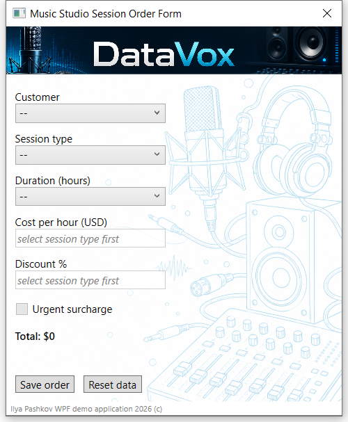
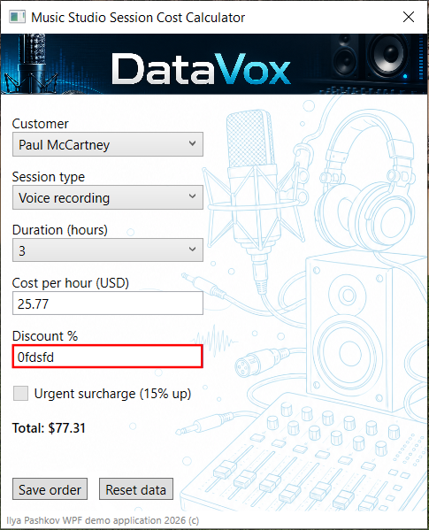
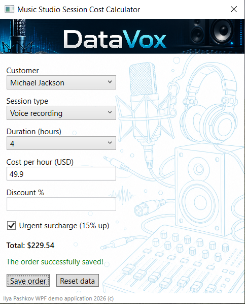

# Studio Session Order Form

## Overview
Studio Session Order Form is a small educational WPF application that simulates creating a music studio session.

The app allows users to select session options, apply discounts or urgent booking surcharges, and calculate the final session price.

## Features
- Customer selection
- Session type selection
- Session duration selection
- Automatic hourly rate calculation
- Manual hourly rate input
- Manual discount input
- Urgent session surcharge
- Final price calculation

## Tech Stack
- C#
- WPF
- Visual Studio 2026

## How to Run
1. Open the project in Visual Studio 2026.
2. Build the project.
3. Run the application.

## Screenshots

